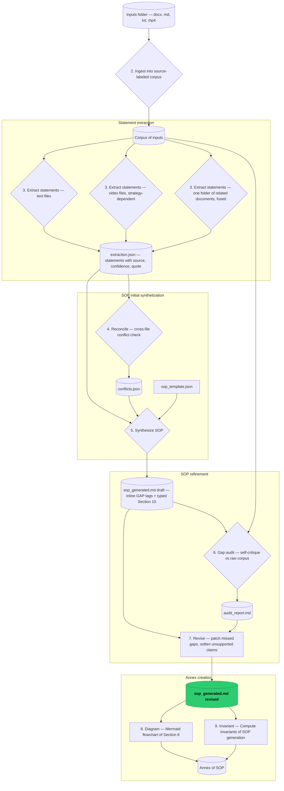

# SOP Generation Pipeline

A **self-contained** pipeline that takes a folder of inputs (meeting transcripts +
supporting documents) and produces a structured **Standard Operating Procedure (SOP)**
in markdown, following a fixed 11-section schema — and **flags gaps instead of
hallucinating** when the inputs are incomplete or contradictory.


## Why

The intended chain is: **raw inputs → SOP (business source-of-truth) → Playbook →
agent**. This module builds the *first link only*: documents/transcripts → SOP. The
SOP is the business spec a Business Analyst (BSA) approves; the pipeline's job is to
do most of the drafting and **surface what's missing** in a structured Gaps section,
so the BSA finishes a draft rather than starting from scratch.

**Guiding principle — flag, don't hallucinate.** Garbage in → "best effort + explicit
gaps", never invented rules. Every gap goes in one structured section (§10), not as
scattered inline comments.

## Setup

```bash
cd sop_pipeline
uv sync
cp .env.example .env   # then add your OPENAI_API_KEY
```

## Usage

```bash
# 1. (dev only) reverse-engineer a varied set of mock inputs from a north-star SOP you supply
uv run sop-pipeline generate-mocks --north-star path/to/sop_north_star.md

# 2. generate an SOP from whatever is in inputs/  ->  out/sop_generated.md
uv run sop-pipeline run --inputs inputs/ --schema-guide path/to/sop_template_guide.md

# 3. (dev only) score the generated SOP against that same north-star reference
uv run sop-pipeline evaluate --sop out/sop_generated.md --north-star path/to/sop_north_star.md
```

The north-star SOP is **not tracked in this repo** — it's the answer key, and checking
it in would let it leak into what's being tested. `--north-star` is required for both
`generate-mocks` and `evaluate`; point it at your own trusted SOP file.

The schema guide (the 11-section template the generator must follow) is also **not
tracked in this repo**. `--schema-guide` is required for `run`; point it at your own
schema guide file.

To run on real client data, drop the transcripts/documents/recordings into `inputs/`
(`.docx`, `.md`, `.txt`, `.mp4` supported) and run step 2.

Files that are related to each other — e.g. a recording, its transcript, notes about it —
go in a subfolder of `inputs/`. Each subfolder is extracted as one unit.

## Layout

| Path | What it is |
|---|---|
| `prompts/` | The pipeline logic lives here as prompt files (most of the "code"). |
| `reference/sop_north_star.md` | **Not tracked in the repo.** User-supplied source-of-truth SOP, passed via `--north-star`. Used for grading **only** — never fed to the generator. |
| (user-supplied schema guide) | **Not tracked in the repo.** The 11-section schema the generator must follow, passed via `--schema-guide`. **Is** fed to the generator. |
| `inputs/` | The inputs folder the pipeline ingests. |
| `out/` | Generated SOP (with Mermaid Annex), standalone `.mmd` diagram + rendered `.svg`, gap audit report, extraction JSON, evaluation report. |
| `fixtures/coverage_manifest.md` | Ground truth for the mock set: what each file omits/contradicts. |
| `src/sop_pipeline/` | Thin glue: CLI, ingest, OpenAI wrapper, orchestration. |
| `src/sop_pipeline/video/` | The video module: recordings → statements. Several interchangeable extraction strategies — see [its README](src/sop_pipeline/video/README.md). |

## Pipeline stages

1. **generate-mocks** (`prompts/01`) — north star → varied mock inputs + coverage manifest.
2. **ingest** (`ingest.py`) — read inputs into a source-labeled corpus.
3. **extract** (`prompts/02`) — per file → structured extracted statements with source + confidence + conflicts.
  - `prompts/02_extract.md` for text files
  - the **video module** (`src/sop_pipeline/video/`) for recordings, producing the same statement list plus a `supporting_media` timestamp range. It offers several interchangeable extraction strategies, selected in documented in [`src/sop_pipeline/video/README.md`](src/sop_pipeline/video/README.md)
  - `prompts/02_extract_folder.md` for a subfolder of `inputs/` — several records of one session. Its recordings are extracted first, then one fused call over them plus the folder's text yields a single statement list: agreement consolidated, disagreement kept as two statements.
4. **reconcile** (`prompts/07`) — cross-file reduce step: compares every extracted statement against every other to catch same-subject, differing-value disagreements a single-file extraction can't see (e.g. a 5-day vs 10-day threshold). Feeds `synthesize` a `conflicts.json` list to render as typed `AMBIGUITY` gaps.
5. **synthesize** (`prompts/03`) — extracted statements + reconciled conflicts + SOP template → full SOP, with inline `[GAP G-xx]` + typed §10.
6. **gap audit** (`prompts/04`) — self-critique: catch hallucinations + missing gaps against the raw source corpus.
7. **revise** (`prompts/08`) — surgical patch: applies the audit's findings back onto the SOP (add/retype/reword gaps, soften unsupported claims) without inventing new content. Followed by deterministic structural checks (gap-ID references, fork-branch completeness, systems coverage) whose warnings are appended to `out/gaps_report.md`.
8. **diagram** (`prompts/06`) — Mermaid `flowchart TD` mirroring the SOP's Section 6 steps, appended to the SOP as `## Annex 1: Mermaid diagram` (also written to `out/sop_flow_diagram.mmd`).
9. **invariants** (`prompts/09`) — Gather invariants that apply to the whole SOP.



- **Facts are extracted** in step 3 (`EXTRACT_TEXT` / `EXTRACT_VIDEO`), one source file at a time — each statement carries its source, a verbatim quote, and a confidence level. Recordings go through the video module, whose chosen strategy decides how the file is turned into statements; the rest of the pipeline is identical either way.
- **Facts are synthesized** in step 5 (`SYN`), where the per-file statements, the cross-file conflicts from step 4, and the 11-section schema guide are combined into one draft SOP.
- **Conflicts and gaps surface in layers, never inline as silent guesses:** cross-file value conflicts are caught deterministically in step 4 (`RECON`) and rendered as typed `AMBIGUITY` gaps during synthesis; anything synthesis still misses (hallucinations or ungapped assertions) is caught by the step 6 self-critique (`AUDIT`) and patched into the SOP by step 7 (`REVISE`)
## Docs

Each stage explained in plain language first, then in technical detail:

- [docs/overview.md](docs/overview.md) — how the three commands fit together, full data flow.
- [docs/generate-mocks.md](docs/generate-mocks.md) — how the test inputs are manufactured.
- [docs/run-pipeline.md](docs/run-pipeline.md) — how ingest → extract → synthesize → gap-audit works.
- [docs/evaluate.md](docs/evaluate.md) — how the generated SOP is scored against the north star.

## Testing

Run test in tests/ folder with:

```
uv run pytest tests/__my_test_file__
```